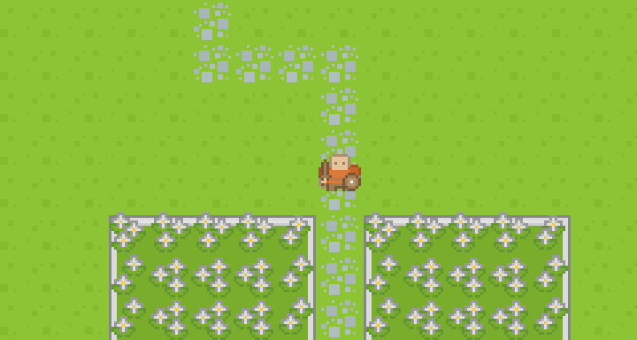

# Me

Hello! This is **Bahadir Kandemir**.

I'm a software developer living in **Espoo, Finland**. I work at **Unity** as a backend developer, and I develop games on my leisure time.

There's nothing much here to see but you can play my Role Playing Game on GitHub.

Have fun!

# RPG on GitHub

<a href="https://github.com/bahadir/bahadir/issues/new?assignees=&labels=game-input&template=go_left.md&title=Go+left">⬅️</a> <a href="https://github.com/bahadir/bahadir/issues/new?assignees=&labels=game-input&template=go_up.md&title=Go+up">⬆️</a> <a href="https://github.com/bahadir/bahadir/issues/new?assignees=&labels=game-input&template=go_down.md&title=Go+down">⬇️</a> <a href="https://github.com/bahadir/bahadir/issues/new?assignees=&labels=game-input&template=go_right.md&title=Go+right">➡️</a> *Click the buttons to create a **Github Issue** that gives an order to the hero.*

## Tip of the day
Map is larger than the viewport. Hero can move around the map.
