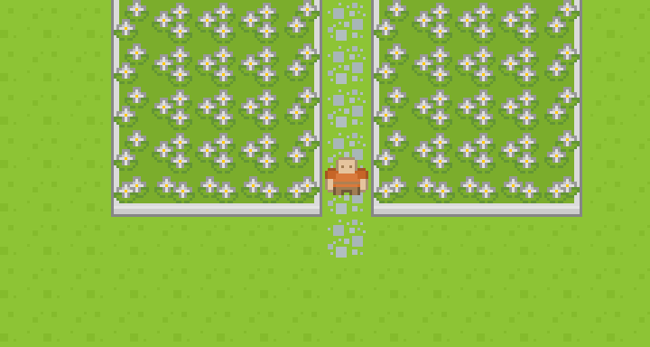

# Me

Hello! I'm **Bahadir Kandemir**.

I live in **Finland**, and work at **Unity** as a Senior Software Engineer. I’m not on the engine team, but I still get to build game development tools and create small games in my spare time.

I enjoy experimenting with small projects, trying out new gameplay ideas, and exploring creative tools and technologies. While there's not a lot to showcase here yet, you can check out my Role Playing Game project on GitHub. It's a small but fun game you can play using Github Issues.

Thanks for stopping by, and I hope you enjoy it!

# RPG on GitHub

<a href="https://github.com/bahadir/bahadir/issues/new?assignees=&labels=game-input&template=go_left.md&title=Go+left">⬅️</a> <a href="https://github.com/bahadir/bahadir/issues/new?assignees=&labels=game-input&template=go_up.md&title=Go+up">⬆️</a> <a href="https://github.com/bahadir/bahadir/issues/new?assignees=&labels=game-input&template=go_down.md&title=Go+down">⬇️</a> <a href="https://github.com/bahadir/bahadir/issues/new?assignees=&labels=game-input&template=go_right.md&title=Go+right">➡️</a> *Click the buttons to create a **Github Issue** that gives an order to the hero.*

## Tip of the day
Star [this repository](https://github.com/bahadir/bahadir) to give XP to the hero. Hero needs XP to level up.
